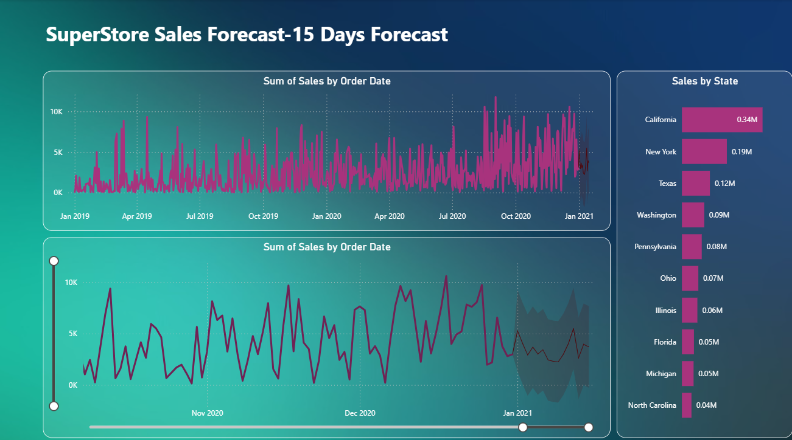

# Power BI Superstore Sales Dashboard

📊 This project showcases an interactive **Power BI dashboard** built using the Superstore dataset.  
It provides a complete view of sales performance, customer behavior, and regional trends, with the ability to drill down into specific categories, states, and segments.  
The dashboard also includes a **15-day sales forecast** to support business decision-making.  

---

## 🔹 Key Insights

- **Overall Performance**: Track total sales, profits, quantity sold, and delivery timelines.  
- **Regional Analysis**: Compare sales and profits across **Central, East, West, and South US regions** using interactive filters.  
- **State-Level Trends**: Drill down into states to identify top-performing and underperforming regions.  
- **Category & Sub-Category Insights**: Analyze contributions of **Office Supplies, Furniture, Technology**, and sub-categories like Chairs, Phones, and Binders.  
- **Customer Segments**: Explore purchasing patterns across **Consumer, Corporate, and Home Office** segments.  
- **Payment & Shipping Preferences**: Discover the most used payment modes (COD, Online, Cards) and shipping methods (Standard, Second Class, First Class).  
- **Time Trends & Forecasting**: View monthly sales and profit growth (YoY) and leverage a **15-day sales forecast** for future planning.  

---

## 🔹 Features
- 📈 Interactive KPIs for sales, profits, and delivery performance  
- 🌍 Geographic sales and profit breakdown by region and state  
- 🔎 Drill-down filters for category, sub-category, segment, and region  
- 🔮 Predictive analytics with **15-day sales forecasting**  
- 🛠 User-friendly design for quick business insights  

---

## 🔹 Project Preview

### Dashboard Overview

### Forecast Dashboard

---

## 🔹 Dataset

The dashboard is built using the **Superstore Sales Dataset**.  
- File: `SuperStore Sales DataSet (1).xlsx`  
- Contains detailed sales transactions including:
  - Order date, ship date, and customer details  
  - Product categories and sub-categories  
  - Sales, quantity, discounts, and profit  
  - Regional and state-wise sales information  

This dataset is included in the repository so you can reproduce and explore the analysis.  

---

## 🔹 How to Use
1. Download the `.pbix` file (`Superstore.pbix`) from this repository.  
2. Open it in **Power BI Desktop**.  
3. Use filters and slicers (Region, Category, Segment, etc.) to explore insights interactively.  

---

## 🔹 Tech Stack
- **Tool:** Microsoft Power BI  
- **Dataset:** Superstore Sales Dataset (`SuperStore Sales DataSet (1).xlsx`)  
- **Visuals Used:** KPIs, Donut Charts, Line Charts, Bar Charts, Maps, Forecasting Models  

---

## 🔹 Author
👤 Created by *Srikar*  
🔗 LinkedIn: 
www.linkedin.com/in/srikarpittala  

---
